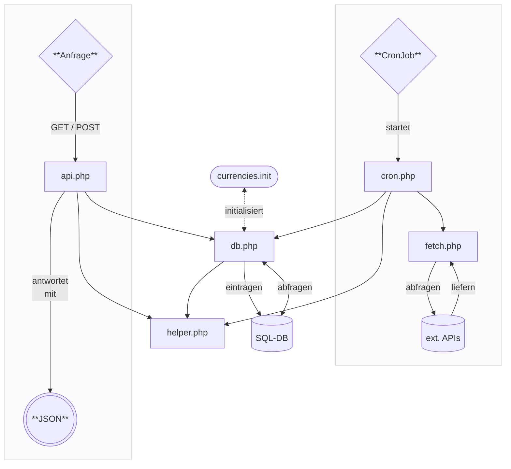

# Easy Cash & Tax Forex API

Dies ist ein serverseitiges Zusatzmodul für die [Easy Cash & Tax Mini-Finanzbuchhaltung](https://github.com/Thomas-Mielke-Software/EasyCash).

Es ist dazu gedacht, Wechselkurse per Web-API bereitzustellen, um die Funktionalität der EC&T-Software um einen Währungsrechner zu erweitern und das Verbuchen von Fremdwährungen zu erleichtern. "Fremdwährungen" meint in diesem Fall: Fiat-Währungen, Krypto-Währungen, Stablecoins und Token.

Unabhängig vom EC&T-Kontext ist es selbstverständlich möglich, dieses Skript auch für andere Zwecke auf seinem eigenen Webserver laufen zu lassen und sich somit über die Zeit eine eigene Datenbank mit gewünschten Wechselkursen anzulegen.

<br>

> ### Inhaltsverzeichnis
> 1. [Funktionsweise](#funktionsweise)<br>
> 2. [Installation](#installation)<br>
> 3. [Benutzung](#benutzung)<br>
>       3.1 [currency](#benutzung-currency)<br>
>       3.2 [date](#benutzung-date)<br>
>       3.3 [time](#benutzung-time)<br>
>       3.2 [meta](#benutzung-meta)<br>
>       3.2 [oneshot](#benutzung-oneshot)<br>
> 4. [Beispiele](#beispiele)<br>
> 5. [Tipps](#tipps)<br>
> 6. [Kompatiblität](#kompatiblität)<br>
> 7. [Lizenz](#lizenz)

<br>

## Funktionsweise

Die EC&T Forex API besteht im Wesentlichen aus zwei Hauptbereichen:

**(1)** Es läuft eine kontinuierliche Datenabfrage bei externen APIs, um die Wechselkurse in der eigenen Datenbank zu sammeln (Fetching-Prozess). Diese Datenabfrage muss regelmäßig per CronJob auf dem Webserver angestoßen werden – siehe [Installation](#installation). Standardmäßig werden viermal am Tag Daten abgeholt: um 00:00, 06:00, 12:00 und 18:00. Häufiger wird nicht empfohlen, da es sich um relativ große Datenmengen handelt und man für eine Buchhaltung sowieso keine minutengenauen Kurse benötigt, sondern lediglich Tagesschlusskurse. Datenquellen für Kurse sind die [EZB-Referenzkurse](https://www.ecb.europa.eu/stats/policy_and_exchange_rates/euro_reference_exchange_rates/html/index.en.html) (Fiat-Währungen) und [LiveCoinWatch](https://www.livecoinwatch.com/) (Krypto-Währungen, etc.).

**(2)** Die eigene Web-API wird per GET- oder POST-Request angefragt. Sie kann Kurse für eine einzelne Währung oder eine Liste an Währungen als JSON-Array zurückliefern – siehe [Benutzung](#benutzung). Der Fokus der EC&T Forex API liegt auf der Buchhaltungspraxis von Nutzern aus Deutschland und Österreich: es werden die Kurse in der `Basiswährung Euro (EUR)` zurückgeliefert, ebenso sind alle Zeitstempel auf die `Zeitzone Europe/Berlin` geeicht.

Das Skript der EC&T Forex API ist zur besseren Wartbarkeit in mehrere Module (Dateien) aufgeteilt, die sich gegenseitig benötigen. Für einen Grobüberblick, wie die Module miteinander in Beziehung stehen, dient der folgende Flowchart:



Im Übrigen ist der gesamte Quelltext ausführlich (auf Deutsch) kommentiert. Bei tieferem Interesse, oder sollte diese Dokumentation nicht ausreichen, lohnt es sich also, direkt in den Dateien über Abläufe nachzulesen.

<br>

## Installation

Ein paar Vorarbeiten sind zu erledigen, dass die EC&T Forex API ihren Dienst aufnehmen kann:

<br>

**Kopieren**<br>
Das Verzeichnis `ect-forex-api` (oder nur die Dateien darin), kann man einfach in ein beliebiges Unterverzeichnis auf dem Webserver kopieren, welches der Webserver dann ausliefert. Wenn gewünscht, kann die Datei `ect-forex-api.php` auch in `index.php` umbenannt werden, um eine schönere URL für die API zu erhalten.

Acht geben sollte man aber darauf, dass beispielsweise eine bestehende CMS-Installation auf dem Server nicht per `mod_rewrite`, oder Ähnlichem, die URLs umbiegt, sodass keine "unbekannte" Datei "abseits" der dem CMS bekannten Verzeichnisstruktur ausgeliefert wird. In einem solchen Fall muss man dafür Sorge tragen, dass per `.htaccess` der Webserver dieses Verzeichnis parallel und unabhängig vom CMS ausliefern kann.

<br>

**Editieren**<br>
Es sind zwei Dateien zu editieren: `ect-forex-db.php` und `ect-forex-fetch.php`.

In `ect-forex-db.php`, [Zeile 19](https://github.com/Darkwing371/ect-forex-api/blob/164568da33729bede79054070f077e81f3fe71f2/ect-forex-api/ect-forex-db.php#L19), sind die Daten für die Datenbankverbindung einzutragen: Datenbankname, Nutzername und Passwort.

In `ect-forex-fetch.php`, [Zeile 19](https://github.com/Darkwing371/ect-forex-api/blob/164568da33729bede79054070f077e81f3fe71f2/ect-forex-api/ect-forex-fetch.php#L19), ist der persönliche API-Key von LiveCoinWatch einzutragen.

<br>

**API-Key LiveCoinWatch**<br>
Für den Zugriff auf Daten von LiveCoinWatch wird ein API-Key benötigt, welcher nach einer simplen Anmeldung mit einer E-Mail-Adresse kostenlos vergeben wird.

Schrittfolge: Auf der Webseite [livecoinwatch.com/tools/api](https://www.livecoinwatch.com/tools/api) registriert man sich über den Button "Register". Man verwendet eine E-Mail-Adresse auf welche man Zugriff hat. Man erhält eine Bestätigungs-E-Mail, mit welcher man die Anmeldung noch einmal bestätigt. Man loggt sich auf der Webseite ein, über den Button "Login". Im Nutzerbild klickt man auf den Link "Edit Profile". Ganz unten findet man den API-Key, welchen man kopiert und in die Datei `ect-forex-fetch.php` einträgt.

<br>

**CronJob anlegen**<br>
Das eigentliche Kernstück ist das Anlegen des CronJobs für die kontinuierliche Datenabfrage (Fetching-Prozess). Es lohnt sich hierzu, die Kommentare in der Datei `ect-forex-cron.php` zu lesen, insbesondere die Zeilen [31](https://github.com/Darkwing371/ect-forex-api/blob/65f59038ac224c4c185fe5889c6546627f9a6e72/ect-forex-api/ect-forex-cron.php#L31), [121](https://github.com/Darkwing371/ect-forex-api/blob/65f59038ac224c4c185fe5889c6546627f9a6e72/ect-forex-api/ect-forex-cron.php#L121) und [147](https://github.com/Darkwing371/ect-forex-api/blob/65f59038ac224c4c185fe5889c6546627f9a6e72/ect-forex-api/ect-forex-cron.php#L147).

Ziel ist es, den CronJob in der ersten Minute einer vollen Stunde das Skript `ect-forex-cron.php` auszuführen zu lassen. Dazu trägt man in der crontab (Befehl `crontab -e`) folgende Zeile ein:

``
1 * * * * php pfad/zu/ect-forex-cron.php
``

Eine Besonderheit beim Shared Hosting: Sollte man sich im Shared Hosting befinden, hat man üblicherweise keinen direkten Zugriff auf die crontab. Hier bietet der Hoster aber gewöhnlich eine Web-Oberfläche zur Verwaltung an, in welcher man CronJobs, bzw. eine "Cron-Simulation" anlegen kann. Mithilfe einer solchen Funktion stellt man die regelmäßige Ausführung des Skriptes `ect-forex-cron.php` ein: stündlich, zu jeder ersten Minute.

<br>

**currencies.init**<br>
Eine besondere Bedeutung nimmt die Datei `ect-forex-currencies.init` ein. Diese Datei wird bei der **ersten** Ausführung des Fetching-Prozesses **einmalig** eingelesen und initialisiert die Datenbank durch Erstellung der Look-up-Tabelle `forex_lut` (LUT). Sobald das System initialisiert wurde, wird diese Datei vom Skript nicht wieder verwendet.

Die Datei `ect-forex-currencies.init` ist im Wesentlichen eine CSV-Datei und beinhaltet Angaben darüber, welche Währungen zukünftig bei einem Fetching-Event abgeholt und in die eigene Datenbank geschrieben werden sollen. Es befinden sich initial etwa 3.000 Werte darin. Darunter Fiat-Währungen, Krypto-Währungen, Stablecoins und Token. Praktisch sinnvoll sind etwa die ersten 50–100 Werte. Der Vollständigkeit halber befinden sich jedoch alle börsengehandelten Coins und Token (mit mehr oder weniger Handelsaktivität) in der Liste. Diese werden per Default komplett eingepflegt. Durch vorheriges Editieren der Datei (Löschen von Zeilen) kann man also seine eigene initiale Auswahl an gewünschten Währungen treffen.

Belehrung: Die Datei `ect-forex-currency.init` **muss zwingend** in der Codepage `UTF-8` sein!

<br>

## Benutzung

Es sollte selbstverständlich sein, dass mindestens ein erfolgreiches Fetching-Event stattgefunden haben muss, sodass die Datenbank initialisiert wurde und die ersten Daten verfügbar sind. Erst danach kann die API Daten liefern.

Die API der EC&T Forex API nimmt Anfragen per GET oder POST entgegen. Im Folgenden wird das Abfragen der API per GET dargestellt. Dazu wird die Datei `ect-forex-api.php` mit einem Query-String und einer Kombination aus folgenden Parametern, plus entsprechenden Werten, erwartet:

`currency` `date` `time` `meta` `oneshot`

```
…/ect-forex-api.php?currency={}&date={}&time={}&meta={}&oneshot={}
```
Praktische Anwendungen und weitere Beispiele siehe Kapitel [Beispiele](#beispiele).

<br>


**Detaillierte Beschreibung**

<a id="benutzung-currency" href="benutzung-currency"></a>

| Parameter  | Zulässige Werte | Default |
| ---------  | --------------- | ------- |
| `currency` | • Tickersymbol<br>• kommaseparierte Liste von Tickersymbolen<br>• '*' (Allstar-Operator)<br><br>Beispiel: `currency=BTC,XMR,XCH,CHF`<br><br>Unschädlich:<br>• Kleinschreibung<br>• mehrere Kommas<br>• Kommas an Beginn und Ende<br>• Leerzeichen zwischen Werten | n/a<br><br>Ohne Währung: Error |

Der Parameter `currency` erwartet als Wert mindestens ein Tickersymbol, um eine Antwort zurückzuliefern. Die Tickersymbole (wie bspw. 'BTC', 'USD', 'XCH', 'DOGE') findet man auf den entsprechenden Börsen oder Datenaggregatoren wie [LiveCoinWatch](https://www.livecoinwatch.com/).

Da leider die Tickersymbole im Speziellen bei Kryptowährungen und Token nicht standardisiert sind – bzw. ein und derselbe Token auch auf mehreren Chains oder Ökosystemen laufen kann – kommt es zwangsläufig in einigen Fällen zu Doppelungen oder gar mehrfacher Verwendung eines Währungstickers. Die EC&T Forex API verwendet deswegen ihr eigenes Währungsticker-Schema, um derartige Doppelungen aufzulösen: bei Mehrfachverwendung erhält ein Währungsticker einen laufenden numerischen Index ('.N') angehangen. Beispiel: 'CAD' (Kanadischer Dollar) und 'CAD.2' (Caduceus Protocol).

In der Datei `ect-forex-currencies.init` befinden sich sämtliche verfügbare Währungsticker mit bereits aufgelösten Doppelungen. Man findet also für die API verwendbare Währungsticker in: **(a)** eben dieser Datei, **(b)** nach der Initialisation in der Datenbanktabelle `forex_lut` (Look-up-Tabelle, LUT), **(c)** im JSON-Objekt, generiert durch das Aufrufen der API mit der besonderen Parameter-Kombination `currencies=*&oneshot` (schnell) – siehe [Benutzung / oneshot](#benutzung-oneshot) –, oder **(d)** in der HTML-Tabelle, generiert durch das Aufrufen der API ohne jeglichen Parameter (langsam) – siehe [Beispiel (6)](#beispiel-6).

**Sonderfall:** Wird für `currency` der Wert '*' (Allstar-Operator) übergeben, werden **alle** in der Datenbank geführten Währungen mit Kursen zurückgegeben. Diese Operation ist sehr kostenintensiv, dauert sehr lange und produziert sehr große Datenmengen. Sie sollte nur zu Testzwecken verwendet werden.

**Default / Fehler:** Wenn der Parameter `currency` nicht gesetzt wurde, oder kein Wert für diesen mitgegeben wurde, so gibt die API einen Fehler aus:

```
{ "error": "no currency requested" }
```

<br>
<br>

<a id="benutzung-date" href="benutzung-date"></a>

| Parameter  | Zulässige Werte | Default |
| ---------  | --------------- | ------- |
| `date`     | • Datum im Format 'YYYY-MM-DD'<br><br>Beispiel: `date=2025-01-21`<br><br>Unschädlich:<br>• Datum im Format 'YYYY-MM-D'<br>• Datum im Format 'YYYY-M-DD'<br>• Datum im Format 'YYYY-M-D'<br> | aktuelles Datum |

Der Parameter `date` erwartet als Wert ein Datum im internationalen Format 'YYYY-MM-DD'. Sollten, abweichend vom Format, nur einstellige Werte (ohne führende Null) für Monat und/oder Tag übergeben werden, so würde dies trotzdem als gültiges Datum interpretiert werden.

**Default:** Wenn der Parameter ``date`` nicht gesetzt wurde, oder kein Wert für diesen mitgegeben wurde, dann nutzt die API das aktuelle Datum für die Anfrage (Serverdatum in der Zeitzone `Europe/Berlin`).

**Fehler:** Wenn dem Parameter `date` ein ungültiges Datum mitgegeben wurde (z. B. '5000-13-37'), so gibt die API einen Fehler aus:

```
{ "error": "invalid date requested" }
```

<br>
<br>

<a id="benutzung-time" href="benutzung-time"></a>

| Parameter  | Zulässige Werte | Default |
| ---------  | --------------- | ------- |
| `time`     | • Uhrzeit im Format 'HH:MM'<br>• Stunde im Format 'HH'<br><br>Unschädlich:<br>• Uhrzeit im Format 'HH:M'<br>• Uhrzeit im Format 'H:MM'<br>• Uhrzeit im Format 'H:M'<br>• Stunde im Format 'HH:'<br><br>Beispiel: `time=21:12`, `time=24` | aktuelle Uhrzeit |

Der Parameter `time` erwartet als Wert eine Uhrzeit im Format 'HH:MM', oder eine Stunde im Format 'HH'. Sollten, abweichend vom Format, nur einstellige Werte (ohne führende Null) für Stunde und/oder Minute übergeben werden, so würde dies trotzdem als gültige Uhrzeit interpretiert werden. Sollte unbeabsichtigterweise nur ein Stundenfragment im Format 'HH:' übergeben worden sein, so würde dies trotzdem als gültige Stunde interpretiert werden.

Für `time` sind theoretisch alle Uhrzeiten von '00:00' bis '23:59' möglich. Fakt ist jedoch, dass sich die Kursdaten nicht in Minutenauflösung in der Datenbank befinden. Die API trägt aber automatisch dafür Sorge, dass ein Kurs zurückgeliefert wird, dessen Zeitstempel der angefragten Zeit am nächsten liegt. Es wird dennoch empfohlen, die Abfragen so zu gestalten, dass sie mit den bekannten Fetching-Zeiten (per Default: 00:00, 06:00, 12:00, 18:00 [und 24:00]) kongruent sind.

**Sonderfall:** Es kann für `time` der besondere Wert '24:00' oder '24' übergeben werden. Da die logische Sekunde "24:00 an diesem Tag" gleich "00:00 am nächsten Tag" ist, wird der Kurs aus der "nullten Stunde" des nächsten Tages zurückgegeben. Auf diese Weise kann man den Tagesschlusskurs für ein Datum um Mitternacht erhalten.

**Default:** Wenn der Parameter `time` nicht gesetzt wurde, oder kein Wert für diesen mitgegeben wurde, dann nutzt die API die aktuelle Uhrzeit für die Anfrage (Serverzeit in der Zeitzone `Europe/Berlin`).

**Fehler:** Wenn dem Parameter `time` eine ungültige Uhrzeit, oder eine ungültige Stunde mitgegeben wurde (z. B. '80:085', 24:01 oder '25'), so gibt die API einen Fehler aus:

```
{ "error": "invalid time requested" }
```

<br>
<br>

<a id="benutzung-meta" href="benutzung-meta"></a>

| Parameter  | Zulässige Werte | Default |
| ---------  | --------------- |  ------ |
| `meta`     | • '0' (keine Metadaten)<br>• '1' (nur Zeitstempel)<br>• '2' (alle Metadaten)<br><br>Beispiel: `meta=2`<br><br>Unschädlich:<br>• nicht gesetzt (→ Default)<br>• ohne Wert (→ implizit '1')<br>• Wert <0, >2 (→ Default) | 0 |

Der Parameter `meta` erwartet als Wert eine Zahl {0..2}. Sie gibt das Detaillevel der zurückzugebenden Metadaten einer Währungsabfrage an.

Level 0: keine Metadaten werden mitgegeben.<br>
Level 1: nur der Zeitstempel des Kurses wird mitgegeben.<br>
Level 2: alle verfügbaren Metadaten zu einer Währung werden mitgegeben (Zeitstempel, beantwortete Anfragen, vollständiger Name, Typ, Datenquelle, Link zur Datenquelle).

**Implizit:** Der Parameter `meta` kann implizit verwendet werden, das heißt: wenn der Parameter ohne Wert gesetzt ist, wird der Wert als '1' interpretiert (Kurznotation).

**Default / Fehler:** Wenn der Parameter `meta` nicht gesetzt wurde, oder ein Wert außerhalb des Wertebereiches {0..2} für diesen mitgegeben wurde, so wird der Default-Wert von '0' interpretiert. Die API gibt keinen Fehler aus.

**Sonderfall:** Sollte bei einer Währungsabfrage ein Fehler auftreten, bspw. wegen eines nicht gefundenen Währungstickers, so gibt die API immer bei der Antwort ein `meta`-Datenfeld für diese Währung zurück, in welchem der Fehler mitgegeben wird – siehe [Beispiel (5)](#beispiel-5).

<br>
<br>

<a id="benutzung-oneshot" href="benutzung-oneshot"></a>

| Parameter  | Zulässige Werte | Default |
| ---------  | --------------- | ------- |
| `oneshot`  | • '0' (normale Antwort)<br>• '1' (Oneshot-Modus)<br><br>Beispiel: `oneshot=1`<br><br>Unschädlich:<br>• nicht gesetzt (→ Default)<br>• ohne Wert (→ implizit '1')<br>• Wert <0, >1 (→ Default)<br>• Währungsliste | 0 |

Der Parameter `oneshot` erwartet als Wert eine Zahl {0..1}. Sie gibt an, ob der Oneshot-Modus angeschaltet ('1') oder ausgeschaltet ('0') ist (also eine normale Abfrage stattfindet).

Der Oneshot-Modus bietet die Möglichkeit, einen Kurs für einen einzigen Währungsticker, schnell und einfach, ohne Umschweife abzufragen. Eine Auswertung von Arrays entfällt somit, es muss lediglich der Rückgabewert auf einen möglichen Fehler geprüft werden – siehe [Beispiel (4)](#beispiel-4).

`oneshot` ist sehr wirkmächtig: es überschreibt andere gesetzte Parameter. Im Oneshot-Modus haben übergebene Währungslisten keine Bedeutung; es wird nur der Kurs der ersten Währung in der Liste zurückgegeben. Der Parameter `meta` wird ebenfalls überschrieben; es werden keinerlei Metadaten zurückgegeben. `date` und `time` behalten allerdings ihre normale Funktion.

**Implizit:** Der Parameter `oneshot` kann implizit verwendet werden, das heißt: wenn der Parameter ohne Wert gesetzt ist, wird der Wert als '1' interpretiert (Kurznotation).

**Default:** Wenn der Parameter `oneshot` nicht gesetzt wurde, oder ein Wert außerhalb des Wertebereiches {0..1} für diesen mitgegeben wurde, so wird der Default-Wert von '0' interpretiert. Die API gibt keinen Fehler aus.

**Fehler:** Sollte eine Währung nicht gefunden werden und somit kein Kurs geliefert werden können, dann gibt die API im Oneshot-Modus folgenden Fehler aus:

```
"error"
```

**Sonderfall**: Wenn der Allstar-Operator '*' mit `oneshot` kombiniert wird (`currency=*&oneshot`), so ist dieser Zustand theoretisch nicht definiert, weil keine spezifische Währung ermittelt werden kann. Stattdessen gibt in diesem besonderen Fall die API ein JSON-Objekt aus, welches alle verfügbaren Währungen und den dazugehörigen, vollständigen Namen beherbergt:

```
{
  "AUD": "Australischer Dollar",
  "BGN": "Bulgarischer Lev",
  "BRL": "Brasilianischer Real",
  "CAD": "Kanadischer Dollar",
  "CHF": "Schweizer Franken",
  …
}
```


<br>

## Beispiele

<br>

**(1)** `…/ect-forex-api.php?currency=BTC`

Gibt den aktuellen Kurs von Bitcoin (BTC) zurück. Datum und Zeit sind nicht explizit gesetzt, also wird der aktuelle Zeitpunkt angenommen. Zusätzliche Metadaten wurden nicht angefordert.

Ergebnis:
```
[
  {
    "currency": "BTC",
    "price": "96117.725770200000"
  }
]
```

**Merke:** Die Antwort einer Kursabfrage erfolgt als numerisch indiziertes Array von JSON Object Literals.

<hr>
<br>

<a id="beispiel-2" href="beispiel-2"></a>

**(2)** `…/ect-forex-api.php?currency=BTC,XCH,CHF&date=2025-01-21&meta`

Gibt die Kurse für Bitcoin (BTC), Chia (XCH) und Schweizer Franken (CHF) für den 21. Januar 2025 zurück. Ein Uhrzeit ist nicht explizit gesetzt, also wird die aktuelle Uhrzeit angenommen. Der `meta`-Parameter ist gesetzt, jedoch ohne expliziten Wert, wird also implizit als '1' angenommen. Es wird daraufhin der Zeitstempel der gefundenen Kurse mit ausgegeben (Level 1).

Ergebnis:

```
[
  {
    "currency": "BTC",
    "price": "101958.941660000000",
    "meta": {
      "timestamp": "2025-01-21 18:01:49"
    }
  },
  {
    "currency": "XCH",
    "price": "19.484434358600",
    "meta": {
      "timestamp": "2025-01-21 18:01:49"
    }
  },
  {
    "currency": "CHF",
    "price": "0.942700000000",
    "meta": {
      "timestamp": "2025-01-21 18:01:49"
    }
  }
]
```

**Merke:** Die Metadaten sind pro Währung in einem JSON Object Literal voller JSON Object Literals verpackt.

<hr>
<br>

<a id="beispiel-3" href="beispiel-3"></a>

**(3)** `…/ect-forex-api.php?currency=&date=2025-01-21&time=12:21`

Es wurden zwar Datum und Zeit im korrekten Format gesetzt, jedoch wurde vergessen, eine gewünschte Währung mitzuteilen. Die API reagiert mit einer entsprechenden Fehlerausgabe.

Ergebnis:

```
{ "error": "no currency requested" }
```

**Merke:** Ein Fehler wird nicht in ein Array aus JSON Object Literals verpackt, sondern ist ein einzelnes JSON Object Literal.

<hr>
<br>

<a id="beispiel-4" href="beispiel-4"></a>

**(4)** `…ect-forex-api.php?currency=BTC,XMR&time=12:00&meta=2&oneshot`

Es wurde ein Liste an Währungen angefragt, Bitcoin (BTC) und Monero (XMR). Ein Datum wurde nicht explizit gesetzt, jedoch eine Uhrzeit. Es wird daraufhin das aktuelle Datum verwendet und die gesetzte Uhrzeit. Es wurden detaillierte Metadaten (Level 2) angefragt. Allerdings wurde der `oneshot`-Parameter gesetzt, überschreibt also viele Angaben wieder und erzeugt eine kurze Ausgabe: die API wird nun nur von der ersten Währung in der Liste (BTC) einen Kurs für den heutigen Tag um 12:00 zurückliefern.

Ergebnis:

```
"96117.725770200000"
```

Dies ist selbstverständlich nicht die Art und Weise, wie man den `oneshot`-Parameter verwenden sollte – das Beispiel sollte nur dessen Mächtigkeit demonstrieren, andere Angaben wieder zu überschreiben.

**Merke:** Oneshot-Ergebnisse sind nicht in einem JSON-Array verpackt, sondern sind reine, kurze JSON-Strings – entweder ein Fehler ("error"), oder ein Kurs in Euro ("96117.725770200000").

<hr>
<br>

<a id="beispiel-5" href="beispiel-5"></a>

**(5)** `…/ect-forex-api.php?currency=BTC,UNFUG&date=2025-01-21&time=24&meta=2`

Er wird eine Liste von Währungen angefragt, Bitcoin (BTC) und Grober Unfug (UNFUG). Es werden die Kurse für einen spezifischen Zeitpunkt angefragt: für den 21. Januar 2025, um Mitternacht. Die Zeit wurde diesmal als Stunde im Format 'HH' angegeben, statt als Uhrzeit im Format 'HH:MM'. Da die logische Sekunde "24:00 an diesem Tag" gleich "00:00 am nächsten Tag" ist, wird der Kurs aus der "nullten Stunde" des nächsten Tages zurückgegeben. Zusätzlich wurden noch detaillierte Metadaten (Level 2) angefragt. Wie sich zeigt, existiert jedoch die Währung 'UNFUG' nicht und es wird ein entsprechender Fehler zurückgegeben.

Ergebnis:

```
[
  {
    "currency": "BTC",
    "price": "101848.195286000000",
    "meta": {
      "timestamp": "2025-01-22 00:01:58",
      "name": "Bitcoin",
      "type": "crypto",
      "source": "LiveCoinWatch",
      "link": "https://www.livecoinwatch.com/price/Bitcoin-BTC"
    }
  },
  {
    "currency": "UNFUG",
    "meta": {
      "error": "not in database"
    }
  }
]
```

**Merke:** Ein Fehler für eine Währung wird in den Metadaten für diese Währung ausgegeben. Dies wäre auch der Fall, wenn `meta=0` gesetzt worden wäre. Eine fehlerhafte Anfrage einer Währung, bzw. die Anfrage einer Währung, die nicht existiert, wird also nicht einfach unterschlagen, sondern es wird in jedem Fall verlässlich ein Fehler zurückgeliefert.

<hr>
<br>

<a id="beispiel-6" href="beispiel-6"></a>

**(6)** `…/ect-forex-api.php`

Ohne jeglichen Parameter aufgerufen, reagiert die API als Web-Frontend: es wird eine lange Liste generiert, mit Werten die in der Kursdatenbank verfügbar sind, und als Webseite angezeigt. Diese Liste wird in der Regel sehr lang und es kann, je nach Serverleistung, eine ganze Weile dauern (> 1 min), bis die Anzeige im Browser schließlich stattfindet.

Dieses Feature ist eher als "dokumentiertes Easter-Egg" gedacht und nicht wirklich Bestandteil der API. Man kann sich so aber "von außen" einen Überblick über die in der Datenbank vorhandenen Werte verschaffen.

<br>

## Tipps

<br>

**Redundante Ausführung**<br>
Die externe Datenabfrage (Fetching) ist natürlich abhängig vom Funktionieren der angefragten APIs. Obwohl diese "immer" funktionieren sollten, kann es in sehr seltenen Fällen vorkommen, dass zu einem Zeitpunkt die HTTP-Requests fehlschlagen, da evtl. der entfernte Server überlastet ist, oder Ähnliches. Ab einem gewissen Punkt wird daraufhin auch der gesamte Fetch fehlschlagen und keine Daten werden in die Datenbank geschrieben. Dies ist praktisch nicht allzu schlimm, da die API sowieso immer den zeitlich nächst näheren Wert für einen Kurs zurückliefert. Sollten diese Fehler allerdings regelmäßig und gehäuft beobachtet werden, so empfiehlt sich, eine redundante Ausführung des Fetching-Skripts `ect-forex-cron.php` einzustellen.

Zusätzlich zur normalen Ausführung (stündlich, 1. Minute), könnte man das Skript einfach noch einmal 20 Minuten später ausführen lassen, dass es aufs neue sein Glück bei der externen API versucht.

In crontab:
```
1 * * * * php pfad/zu/ect-forex-cron.php
21 * * * * php pfad/zu/ect-forex-cron.php
```

Ein mehrmaliges Ausführen innerhalb ein und derselben Stunde ist datensparsam: sollte ein Fetch im ersten Versuch schon erfolgreich ausgeführt worden sein, also die Kursdaten in der Datenbank vorhanden sein, wird er nicht noch ein zweites Mal durchgeführt, selbst wenn das Skript dazu aufgerufen wird.

Anders ausgedrückt: man könnte `ect-forex-cron.php` also auch zehnmal pro Stunde ausführen, es werden immer nur einmal pro Stunde Daten geschrieben.

<br>

**Log-System**<br>
EC&T ist mit einem ausführlichen Log-System ausgestattet. So kann man laufend und einfach in System- oder Betriebsereignisse Einblick erhalten. Zu diesem Zweck existiert die Datenbanktabelle `forex_log` (Log-DB), welche man sich sehr einfach in bspw. phpMyAdmin ansehen kann.

Zusätzlich werden alle besonders wichtigen Meldungen auch im normalen PHP-Error-Log ausgegeben.

<br>

**Große Datenmengen**<br>
Beim etwaigen Betrachten der rohen Forex-Daten in der Datenbanktabelle `forex` (Forex-DB), bspw. per phpMyAdmin, werden höchstwahrscheinlich schon nach kurzer Betriebszeit nicht mehr alle Zeilen der Forex-DB angezeigt werden können. Ab einer gewissen Größe schätzt MariaDB/MySQL (InnoDB) die Datenbank nur noch, abhängig vom Wert [$cfg['MaxExactCount']](https://docs.phpmyadmin.net/de/latest/config.html#cfg_MaxExactCount). Hier sollte man sich nicht verunsichern lassen. Möchte man zu Testzwecken die neusten Werte ansehen, dann sollte man, statt zur letzten Seite der Tabelle zu springen, einfach die Tabelle per 'timestamp' absteigend sortiert betrachten. So erhält man die neusten, "hintersten" Werte als erstes angezeigt.

<br>

**Neue Währung einpflegen**<br>
Soll im späteren Verlauf des Betriebes eine neue (Krypto-)Währung in das System eingepflegt werden, dann sollte diese vorher gut bei der Datenquelle recherchiert worden sein und muss, z. B. per phpMyAdmin, händisch in die Look-up-Tabelle `forex_lut` (LUT), analog zu den schon bestehenden Währungen, eingepflegt werden. Besonders Acht gegeben werden muss in diesem Fall auf mögliche Doppelungen im Tickersymbol: die LUT muss vorher auf das beabsichtigte neue Tickersymbol untersucht werden (SQL: "SELECT * FROM \`forex_lut\` WHERE currency = 'NEU'"). Wird dabei etwas gefunden, würde es zu einer Doppelung kommen. In diesem Fall muss der neue Währungsticker einen laufenden numerischen Index ('.N') angefügt bekommen. Beispiel: 'NEU' schon vorhanden → 'NEU.2' stattdessen als tatsächliches Tickersymbol.

<br>

## Kompatiblität

**Mindestens**<br>
PHP >= 5.6<br>
MariaDB >= 10.2 oder äquivalent MySQL >= 5.7


**Getestet auf**<br>
PHP 7.4 und 8.4<br>
MariaDB 10.11


**Codepage**<br>
Die Quelltext-Dateien sind grundsätzlich in der Legacy-Codepage `Windows-1252`, auch bekannt als `CP1252`, seltener `Western European`, abgespeichert.

Ausnahmen: Die Datei `ect-forex-currency.init` **muss zwingend** in `UTF-8` sein. Ebenfalls sind `LICENSE` und `README.md` in `UTF-8`.

<br>

## Lizenz

Die EC&T Forex API ist freie Open-Source-Software unter der GNU Affero General Public License (Version 3).

GNU AGPL v3: https://www.gnu.org/licenses/agpl-3.0.html

<br>
